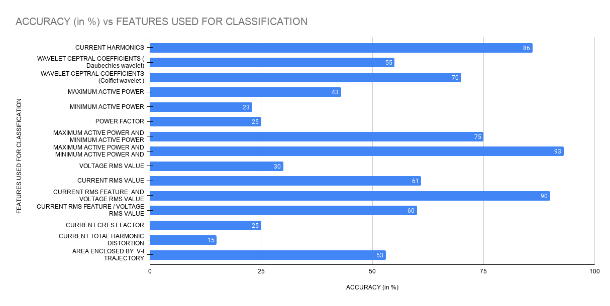

# Electrical-Devices-Identification-Model

## The problem: 
    
Data mining and analysis of energy data of electrical devices in SHs, e.g., for the dynamic load management, is of fundamental importance for the decision-making process of energy management both from the consumer perspective by saving money and also in terms of energy redistribution and reduction of the carbon dioxide emission, by knowing how the energy demand of a building is composed in the SG. 
The purpose of our system is to apply adequate rules to control the electric appliances in order to save energy and money.

# What is done in this project:

Electrical Devices Identification Model (EDIM) for the identification of electrical devices by analyzing their energy consumption profiles. 
                     
Dataset used: WHITED
          
 
 Features used:
<ul>
    <li> Active power RMS </li>
  
<li> Reactive power RMS </li>
<li> Total power RMS </li>
<li> Power factor </li> </li>
<li> Maximum active power </li> 
<li> Minimum active power </li>
<li> Voltage RMS value </li>
<li> Current RMS value </li>
<li> Current total harmonic distortion </li>
<li> Current crest factor </li>
<li> Current harmonics </li>
<li> Wavelet Ceptral coefficients  </li> 

  </ul>

## accuracy chart 

   # FEATURE EXTRACTION FOR ML

                        INTERNSHIP REPORT: ABHISHEK ANAND
                        
                        
## ABSTRACT

Since the inception of non-intrusive appliance load monitoring (NILM), extensive research has focused on identifying an eLective set of features that allows forming a unique appliance signature to discriminate various loads. Although an abundance of features is reported in the literature, most works use only a limited subset of them. Systematic comparison and combination of the available features in terms of their effectiveness is still missing. This report offers a concise and updated review of the features reported in the literature for load identification. A systematic feature elimination process is proposed to identify the most eLective feature set as a second contribution. The analysis is validated on a large benchmark dataset and shows that the proposed feature elimination process improves the appliance classification accuracy for all the appliances in the dataset compared to using all the features or randomly chosen subsets of features.

## INTRODUCTION

A breakdown of energy consumption at the appliance level is not only an essential requirement for energy providers, in designing practical demand response algorithms, but it also benefits residential customers by providing them the necessary information for improving their energy consumption efficiency. Non-intrusive (appliance) load monitoring (NILM) techniques are cost-effective solutions to obtain such information. The general framework of NILM starts from input measurements of total electricity consumption to eventually disaggregate it into each load’s contributions.

A crucial step in NILM is feature extraction, which applies signal processing techniques to extract features from the voltage (V) and current (I) measurements. The ultimate goal of the feature extraction step is to derive a signature (using a feature or combination of features) that can uniquely identify the individual appliances. The performance of any NILM system depends on the uniqueness of the appliance signature compared to that of other devices. Hence, the identification of such a signature is crucial in improving the load discrimination capability of a NILM system. Although NILM has been the subject of research for over two decades, so far, a systematic selection of the various electrical features proposed for effective discrimination of loads has not yet been presented. Identifying the 45 most meaningful electrical parameters to distinguish all appliances remains one of the significant challenges in NILM [42]. In this REPOT, we tackle this issue and contribute to:

1. A concise and up-to-date review of the features reported in recent NILM literature 

2. A systematic signature identification algorithm based on a comprehensive dataset with diverse appliances and various households

## PROPOSED FEATURES

Active power RMS
Reactive power RMS
Total power RMS
Power factor
Maximum active power 
Minimum active power
Voltage RMS value 
Current RMS value
Current total harmonic distortion
Current crest factor
Current harmonics
Wavelet Ceptral coefficients  

   9. Current Total harmonic distortion 

The total harmonic distortion (THD or THDi) is a measurement of the harmonic distortion present in a signal and is defined as the ratio of the sum of the powers of all harmonic components to the power of the fundamental frequency. Distortion factor, a closely related term, is sometimes used as a synonym  
                   

10. Current crest factor 

Crest factor is a parameter of a waveform, such as alternating current or sound, showing the ratio of peak values to the effective value. In other words, the crest factor indicates how extreme the peaks are in a waveform. Crest factor 1 indicates no peaks, such as direct current or a square wave. 
 

## DATABASE DESCRIPTION

  ### WHITED DATASET

 a data set of appliance start-up measurements from several locations. 

The recording was mainly done in households and small industry settings in different regions around the world. 

Thus, it may be possible to extract region-specific grid characteristics from the voltage waveforms in the data.

 To cover all corresponding transients, we recorded the first 5 seconds of the appliance start-ups for 110 different appliances to date, amounting to 47 different appliance types. The aim of this data set is to provide a broad spectrum of different appliance types in regions around the world. 

### REDD DATASET

     detailed power usage information from several homes.

   The REDD data set contains two main types of home electricity data:

  high-frequency current/voltage waveform data of the two power mains
(as well as the voltage signal for a single phase), and
lower-frequency power data including the mains and individual,
labeled circuits in the house. 

   low_freq/              -- ~1Hz power readings, whole home, and circuits

  high_freq/             -- aligned and group current/voltage waveforms

  high_freq_raw/         -- raw current/voltage waveforms

 UK - DALE

1-second data 

There are four columns in each CSV file recording the whole-house power demand every second: 
(1) UNIX timestamp.
 (2) Active power (watts).
 (3) Apparent power (volt-amperes).
 

All four columns record real numbers (not integers). The first column has one decimal place of precision; the other columns have two decimal places of precision. The 1 s data is in a CSV file called mains.dat in directories house_1, house_2, and house_5.

6-second data 

For the 6 s data, the second column in each CSV file is a non-negative integer that records the power demand of the downstream electrical load. The file names of the 6 s data take the form of channel_oX>.dat where X is a positive integer (no leading zero). There are two types of 6 s resolution meters: 
(1) Individual appliance monitor-transmitter plugs that record active power (in units of watts). 

(2) Current transformer meters that record apparent power (in units of volt-amperes). 

Individual appliance monitors have a push-button switch to allow users to turn the connected appliance on and off. We record the activity of this switch in a channel_oX>_button_press. dat file

16 kHz data
 
The 16 kHz data is compressed using the Free Lossless Audio Codec (FLAC)34. For houses 1, 2, and 5 UK-DALE records a stereo 16 kHz audio file of the whole-house current and voltage waveforms.

 The files are labeled vi-oT>.flac where T is a real number recording the UNIX timestamp with microsecond precision (using an underscore as the decimal place). This timestamp is the time at which the audio file began recording. The recordings are split into hour-sized chunks. We also include

a calibration.dat file for each house. This is a text file specifying the multipliers required to convert the raw output of the analog to digital converter to amps and volts. To make use of the FLAC files (for processing in, for example, MATLAB or Python), first, decompress the files to create WAV files. This decompression can be done with many audio tools. We use the audio tool sox33.

 ###  LIT DATASET

A distinguishing feature of the LIT-dataset is that it is composed of three (two)  distinct classes of load monitoring:

Synthetic:  waveforms were collected with a jig that precisely controls the on and off times in a scenario of controlled-load shaping. The jig controls each load, up to eight, using TRIACs and relays, hence, allowing for on-times at specified angles of the mains sine wave. The on and off times are recorded in the waveform with a resolution better than 5 ms, allowing the identification of the mains semi-cycle where the "on" or "off" load-event occurred. Typically waveforms are 30 seconds long at sampling rates above 15 kHz, achieving 256 samples per cycle.

Simulated:  several classes of loads were simulated in a MATLAB/SIMULINK environment and validated against actual loads. The use of simulated loads allows us to modify the load characteristics to create scenarios that would be very difficult/complex to develop in the real world.

## Feature selection and classification model

We use a whited dataset for feature extraction and modeling. 

Whited data has a total of 1339 samples, a comparison of 56 different classes. 

### CURRENT HARMONICS

To extract current harmonics, we take FFT of the current signal. Then we only keep those components that correspond to nth harmonic. Now, we zero pad this array to make it of the same size as the FFT of the original signal.   ( we preserve the index of those nth harmonics in the reconstructed FFT too). Now we do IFFT of this new signal to get the nth harmonic component of the signal. 

 We extract harmonics up to 49th order. 

The original signal is sampled at 44.1Khz . for visualization purposes, we downsample each harmonic component to 50 Hz. 

## FEATURE SELECTION FOR HARMONICS 

For selecting more useful harmonics, we use their relative power in the signal as a feature and find out their relative importance in classification.
performed feature selection using extra tree classifier.
<!--
Which algorithm ??

Add image ??

Final accuracy charts ?? -->

harmonics used:	accuracy

1) all : 86 %
2) 3,5 : 49 %
3) 3,5,7 : 68 %
4) 3,5,7,9 : 76 %
5) 3,5,7,9,11 : 78%
6) 3,5,7,9,11,13 : 80%
7) 3,5,7,9,11,13 ,15 : 81 %
8) 3,5,7,9,11,13,15,17 : 82.23 %
9) 3,5,7,9,11,13, 15, 17, 19 : 82.98%
10) 3,5,7,9,11,13, 15, 17, 19 , 21 : 82.6%
11) 3,5,7,9,11,13, 15, 17, 19,21, 23, : 83.5%
12) 3,5,7,9,11,13, 15, 17, 19,21, 23, 25 : 84.1%

### WAVELET CEPTRAL COEFFICIENTS

first, they are doing DWT using Daubechies wavelet of order 4 and decomposition depth 6, then taking a log and then doing Discrete Cosine Transform (keeping 14 coefficient of DCT), so there will be 7 * 14 = 98 total number of feature per sample.

"It turns out that the Daubechies wavelet of order four and decomposition depth 6 (or Coiflet wavelet with order two and depth 7) is recommended in order to achieve the better CR values"

Using  Daubechies wavelet of order 4 and decomposition depth 6

first, they are doing DWT using Daubechies wavelet of order four and decomposition depth 6, then taking a log and then doing Discrete Cosine Transform (keeping 14 coefficient of DCT), so there will be 7 * 14 = 98 total number of feature per sample.

I Choose 15 features. The accuracy of these selected features is around 55 %.

Insert image ??

Using Coiflet wavelet with order 2 and depth 7

I used the Coiflet wavelet with order two and depth 7. I achieved around 65 % accuracy with all features.
then I chose 17 features from extra tree feature selection out of 14 * 8 = 112 features. This time we achieved around 70 % accuracy.

Image ??

3) MAXIMUM ACTIVE POWER FEATURE 

Accuracy:  43 %

4) MINIMUM ACTIVE POWER FEATURE 

Accuracy: 25 %

5) POWER FACTOR 
Accuracy: 25%

6) VOLTAGE RMS FEATURE
Accuracy: 30%

7) CURRENT RMS FEATURE :
Accuracy: 61%

8) CURRENT RMS / VOLTAGE RMS FEATURE
Accuracy:  60 %

9) VOLTAGE RMS / CURRENT RMS FEATURE 
Accuracy: 60 %

10) CURRENT CREST FACTOR:
Accuracy: 25 %

11) CURRENT TOTAL HARMONIC DISTORTION:
Accuracy: 15 %

12) AREA ENCLOSED BY  V-I TRAJECTORY

Accuracy: 53 %

Combining those features we are achieving around 99.3 % accuracy. 

 ## REFERENCES :

https://www.ttu.ee/public/p/proaktiivtehnoloogiate_teaduslaboratoorium/dissertations/sergei_astapov_-_feature_extraction_from_band-limited_signals_and_classification_of_features_msc_thesis.pdf  

 
http://www.dainf.ct.utfpr.edu.br/~douglas/LIT_Dataset/index.html 

